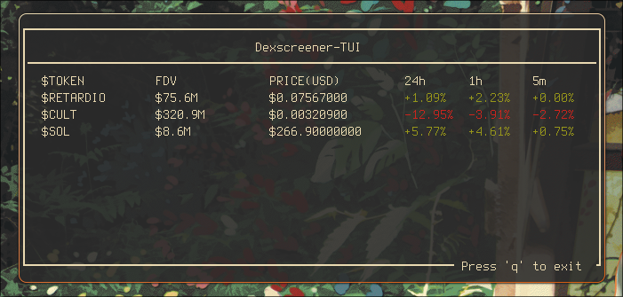

# Dexscreener-TUI

A terminal user interface for tracking token prices from Dexscreener.

## Usage

1. Create a `cas.txt` file with token contract addresses (one per line)
2. Run the program: `python main.py`

Lines starting with '#' in `cas.txt` are treated as comments.
